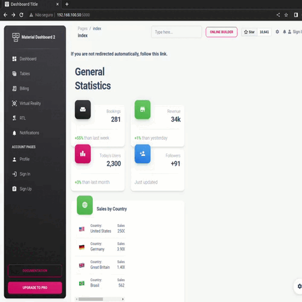

# Dashboard com Flask e Bootstrap

Este é um projeto de dashboard web desenvolvido usando o framework Flask e o framework de front-end Bootstrap.

## Funcionalidades

- Exibição de dados em gráficos e tabelas interativas.
- Integração com banco de dados para armazenar e recuperar informações.
- Páginas de login e autenticação de usuários.
- Personalização da aparência e layout usando Bootstrap.

## Requisitos

- Python 3.x
- Flask
- Bootstrap

## Instalação

1. Clone o repositório para o seu ambiente local:

   ```shell
   git clone https://github.com/eusouanderson/Dashboard-flask.git
    ```

2. Navegue até o diretório do projeto:
    ~~~ bash
    cd Dashboard-flask
    ~~~

3. Crie e ative um ambiente virtual (opcional, mas recomendado):
    ~~~ bash
    python3 -m venv venv
    source venv/bin/activate
    ~~~

4. Instale as dependências:
    ~~~ bash
    pip install -r requirements.txt
    ~~~

5. Execute o aplicativo:

    ~~~ bash
    python app.py
    ~~~

6. Abra o navegador e acesse http://localhost:5000 para ver o dashboard em ação.


## Estrutura do Projeto

app.py: O ponto de entrada do aplicativo Flask.
___
templates/: Diretório contendo os arquivos HTML dos templates.
___
static/: Diretório para arquivos estáticos como CSS, JavaScript e imagens.
___
data/: Diretório para armazenar os dados do aplicativo.
___
config.py: Arquivo de configuração com variáveis ​​de ambiente sensíveis.
___
## Contribuição

Contribuições são bem-vindas! Se você encontrar algum problema ou tiver alguma sugestão, sinta-se à vontade para abrir uma issue ou enviar um pull request.

## Licença
Este projeto está licenciado sob a GNU GENERAL PUBLIC LICENSE.

<p align="center">
    


---


---
Developed by [Anderson B.O.B](https://github.com/eusouanderson)
